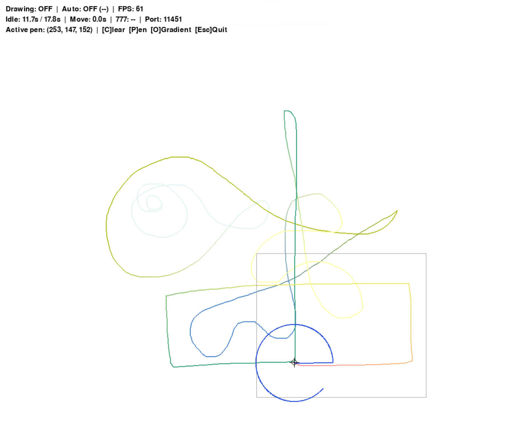

# 神奇绘板 v1.3

## 项目状态

#### ✅写完了
#### ✅测好了

## 功能

- **窗口**: 1080x920 分辨率，锁定 60fps
- **TCP 服务**: 监听端口 11451，支持远程清屏/暂停/退出指令
- **鼠标手绘**: 按住左键拖拽自由绘制，颜色可随时切换
- **边界缓存**: 灰色边界框始终跟随鼠标，越界时清除对侧缓存并重定位边界
- **自动绘制**: 鼠标在手绘线条末端停止 10-39 秒（随机）后，自动从该点开始随机选择一种模式继续绘制
  - **阿基米德螺旋线** — 紧凑尺寸，最大半径 260px
  - **布朗运动** — 高斯步长随机游走
  - **逆时针圆** — 随机半径，线速度约 1 cm/s
- **画笔颜色**: 按 `P` 键随机切换画笔颜色（自动/手动模式均生效）
- **渐变色过渡**: 按 `O` 键从当前颜色渐变到随机新颜色，过渡长度 10 cm（约 378px）
- **777 机制**: 鼠标连续移动满 10 秒后，有 7.77% 概率自动触发随机颜色渐变

## 控制

| 操作 | 功能 |
|------|------|
| 鼠标左键拖拽 | 自由绘制 |
| 鼠标停止 10-39s | 自动绘制（从手绘末端开始） |
| 鼠标移动 | 终止自动绘制 |
| `C` 键 | 清空画布 |
| `P` 键 | 随机画笔颜色（手动/自动均生效） |
| `O` 键 | 启动 10cm 渐变过渡到随机颜色 |
| `Esc` 键 | 退出程序 |

## 安装与运行

请在release中下载exe，双击运行。

## 网络指令

向 `localhost:11451` 发送 TCP 文本指令：

| 指令 | 效果 |
|------|------|
| `clear` | 清空画布 |
| `pause` | 暂停自动绘制 |
| `quit` | 退出程序 |

## 项目结构

```
DrawingBoard/
  drawing_board.py  主程序
  README.md         本文件
  LICENSE           MIT 许可证
  NOREADME.md       AI 对话记录
  .gitignore        Git 忽略规则
```
## 效果预览

## 作者

QQ: 331701160

## 许可证

MIT License — 详见 [LICENSE](LICENSE) 文件。

### 附加条款

若您让 AI 使用了本项目，请创建并将与 AI 对话的过程开源并写入 `NOREADME.md` 文件中（仅限用户发言，省略 AI 回复）。同时，您必须将本附加条款添加到您正在使用的协议最后方。
